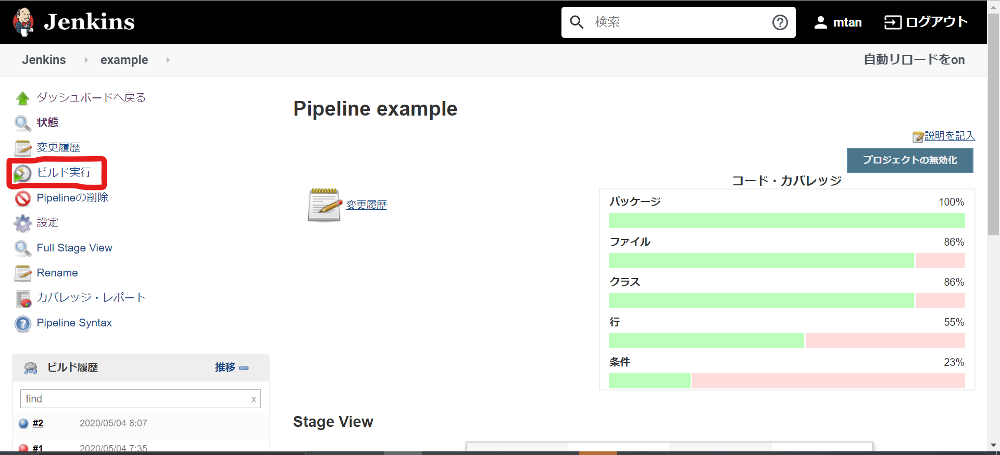

# Tutorial

This tutorial is supported until completing example jenkins jobs.

1. start jenkins docker image.

    ```
        $ docker run -p 8080:8080 -p 50001:50001  -v /var/run/docker.sock:/var/run/docker.sock --privileged --env JENKINS_SLAVE_AGENT_PORT=50001 mtan/jenkins
    ```
2. After jenkins start, you must arrow using docker.sock for user of jenkins.

    ```
    $ docker exec -it -u root $(YOUR JENKINS CONTAINER ID) bash
    $ chmod 666 /var/run/docker.sock
    ```

3. After jenkins is ready, create example project for pipeline.
    

4. Setting below:
    definition      :   Pipeline script from SCM
    SCM             :   git
    repository URL  :   https://github.com/Polonity/google_test_env.git

    

5. Install a plugins
   - docker pipeline
   - cobertura

6. click red squre , start build a example job
   
   


If you complete your job, you can see coverage report on jenkins web.

